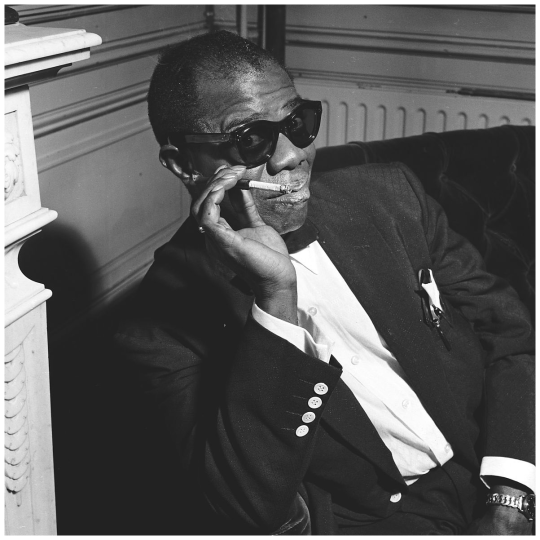

 

Jazz has lived both eras of supreme popularity and stretches of decline, but one thing remains constant: Louis Armstrong, "Satchmo," continues to reign in the hearts of music lovers everywhere. Armstrong’s face is a familiar sight, and his voice even more so, captivating hearts over 50 years since his passing. This immense fame undoubtedly brought considerable pressure and Armstrong expressed later in his life that he turned to marijuana as a means of easing his stressors. By the mid-1920s, he had taken up smoking, and in 1930, he was arrested for possession of marijuana.

The arrest happened in the parking lot of Culver City's Cotton Club, where Armstrong alongside his drummer, Vic Berton, were caught mid-smoke. Berton’s brother later recalled that the pair, still high, were taken to the police station, where they spent the night laughing uncontrollably in their cell. One can imagine the laughter dying down the following morning when they received a sentence of six months in prison and a $1,000 fine. Armstrong himself recounted this tale in a tape recorded in the 1950s, in which he remembered the arresting officer admitting he and his family were great fans of Armstrong’s work. Ultimately, the sentence was dropped, with the prevailing theory attributing this leniency to Armstrong’s connections with influential club owners, who may have swayed the presiding judges.

Interestingly, this was not the last time Armstrong enjoyed privileged treatment for his marijuana use; in fact, he reportedly enlisted help from some highly influential people—one of them being a future president. Though no definitive version of this story exists, several compelling accounts have emerged over the years, sharing a common theme.

One account comes from a trumpet player who toured with Armstrong in later years, who recalls Armstrong describing an encounter with Richard Nixon at a Japanese airport. Nixon, evidently eager to assist, asked Armstrong if there was anything he could do for him. Armstrong responded by asking Nixon to carry a suitcase filled with marijuana through customs. Nixon, apparently unaware of the bag’s contents, obliged, successfully bypassing security for Armstrong. Giving truth to this account is the fact that Armstrong’s wife Lucille was later arrested after carrying what was assumed to be Armstrong’s suitcase.

In another version, jazz legend Miles Davis shared a story he had heard from Tommy Flanagan, one of Armstrong’s pianists. In this version, Armstrong and his band, returning from a show in Paris, met Vice President Nixon in the VIP lounge at Orly Airport. Apparently, Nixon was overwhelmed meeting Armstrong, singing him sweet praises of how much of a national treasure "Satchmo" was. When they heard the announcement for their flight, Nixon insisted on helping Armstrong and his crew with their heap of luggage. Armstrong, recognizing the opportunity, handed Nixon a suitcase filled with marijuana. Nixon, oblivious, carried it through customs with presidential privilege.

A third version of the story places Armstrong returning from Ghana, where he supposedly had a trumpet case filled with marijuana. On this occasion, Nixon greeted Armstrong at Dulles Airport, again offering assistance. Armstrong requested Nixon carry his case through customs and Nixon unwittingly obliged. Although some sources suggest this version of the story may have occurred instead on a return flight from London to New York.

Despite the blurry recounts and undefined truths, each story shares a common thread: Armstrong was adored by all. Everyone loved Louis, from the working middle class watching his shows at night to those in the White House lucky enough to see him live. With such an adoration and in a time when fame held sway, who could resist doing a favor for "Satchmo" himself? 