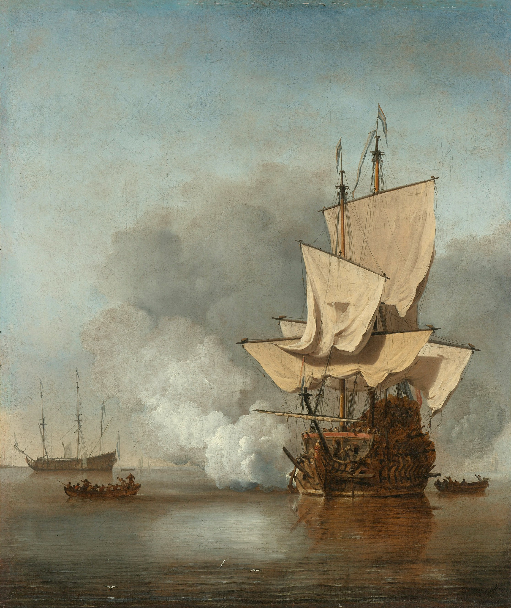
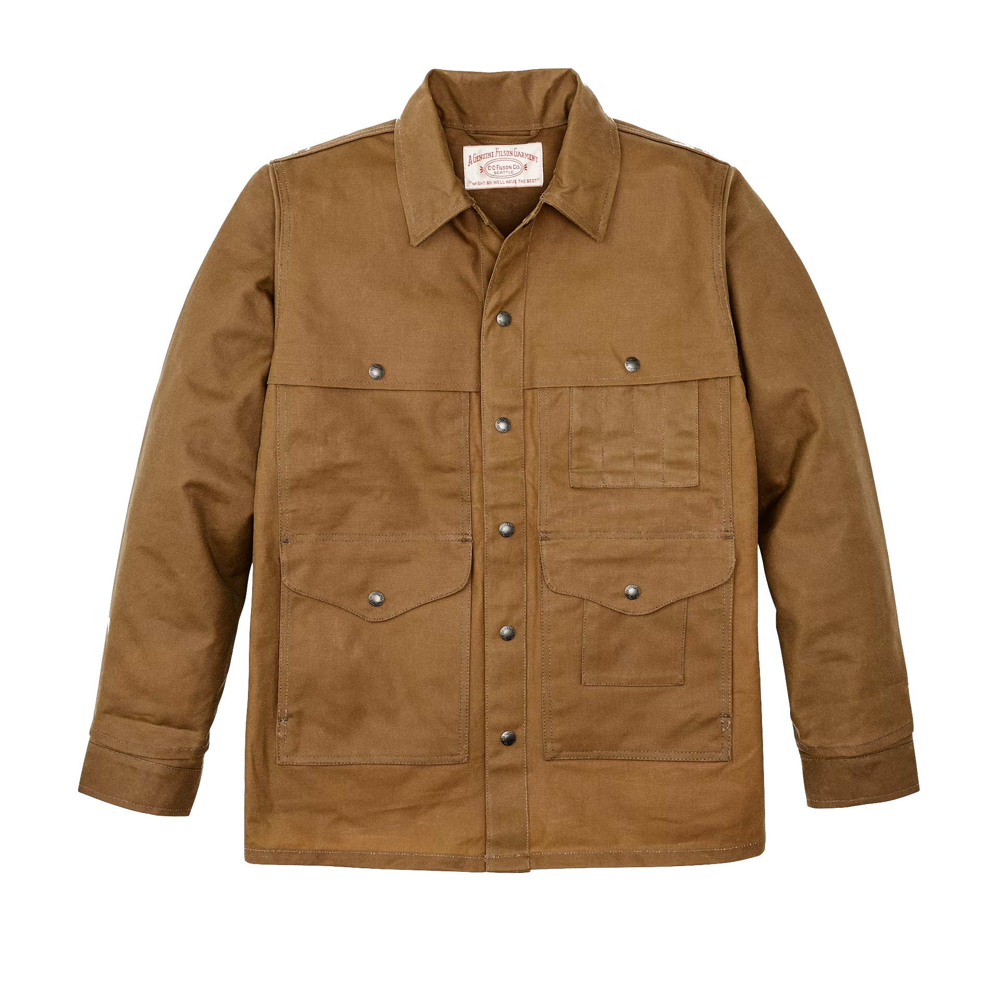
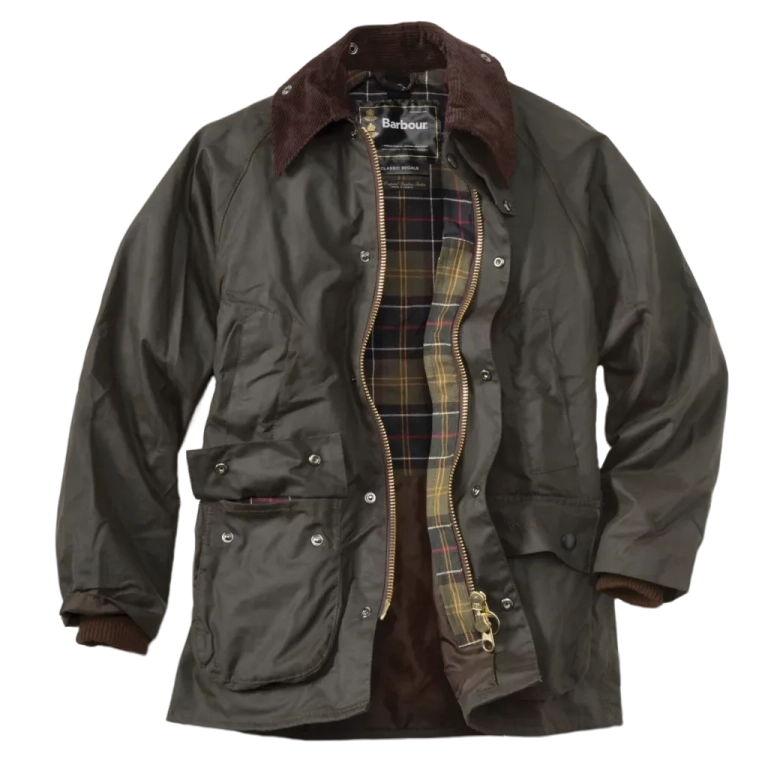

In the late 11th century, Viking longships used wool for their sailcloths. These sailcloths were meticulously woven by hand using an upright warp-weighted loom. Depending on the ship's locality, one of three methods was employed for weaving the wool: two-shaft (also referred to as plain weave), three-shaft (2/1 twill), or four-shaft (2/2 twill). Here, 2/1 and 2/2 refer to the number of threads passing over and under. However, the wool would often suffer damage from the residual moisture of the sea. As the Vikings expanded their trade routes, they gained access to flax-producing regions in Western Europe and the Mediterranean. Thus, the linen sailcloth revolution emerged.

Sailors turned to flax canvas, made from a linen warp and weft, as it was lighter compared to its woolen counterpart. By the 15th century, sailors faced relentless challenges from the elements. Heavy rains soaked their sailcloths, significantly slowing down their vessels. Linen, a bast fiber with high conductivity and irregular slubs along its length, could absorb up to 20% of its weight in moisture. To combat the waterlogged sailcloths, Scottish sailors began rubbing fish oils onto them, creating a thin, water-resistant coating. Mariners of the northern British waters preferred treating their sailcloths with linseed oil, which greatly enhanced their water resistance.

Despite the ongoing evolution of sailcloths—eventually incorporating cotton, hemp, nylon, and even carbon fibers—waxed cotton remains iconic within workwear and heritage wear, thanks in large part to these early innovations with waxed-flax sailcloths. Sailcloths were often too large to be woven on a single loom, so smaller pieces were stitched together. Off-cuts from this process were fashioned into smocks for sailors. Water-resistant and durable, these garments became indispensable for workers braving the cold and wet.

Fast forward to the 1700s, when Scottish weaver Francis Webster introduced the ingenious idea of impregnating canvas with paraffin wax rather than applying linseed oil to the surface. The result was a more breathable and flexible canvas that maintained the same standard of water resistance. Waxed canvas quickly gained popularity, particularly with the British Armed Forces during WWII, making Britain the only military with waterproof clothing. Its widespread adoption over time stands as a testament to its utility and durability, despite its simplicity.

# notable garments

## filson tin cloth cruiser

The Great Klondike Gold Rush of 1897 saw thousands of hopeful souls pass through Seattle en route to the north. C.C. Filson recognized an opportunity and founded C.C. Filson's Pioneer Alaska Clothing and Blanket Manufacturers. Its purpose was to produce the garments that prospectors would wear while mining for gold. A year later, a prospector named Robert McFadden commissioned Filson to create the first cruiser shirt—a work shirt featuring four pockets on the front and a single pocket on the back. Years later, in 1912, Filson patented this design as the "Wool Cruiser Shirt."

By 1920, Filson began importing English "tin cloth" (waxed cotton fabric) from British Millerain and introduced their first "waterproofed khaki" cruising shirt. The Tin Cloth Cruiser became a staple in the Pacific Northwest logging camps, where timber cruisers would scout forests for harvestable timber, mapping sections for logging crews. The signature back pocket served exclusively as a map holder. Over the years, Filson made several iterative updates to the design. In 1922, a single-layer version with reinforced shoulders and sleeves was introduced. By 1934, a variation with a front-shoulder cape was created. Despite controversy over recent changes in ownership and manufacturing, the Filson Tin Cloth Cruiser retains its place in the history of waxed garments due to its timeless appeal and practical utility.

## barbour bedale

Founded in 1894 in South Shields, England, Barbour began as J. Barbour & Sons, producing suits for nearly every British International motorcycle team from 1936 to 1977. It was Duncan Barbour, the third generation of the family and an avid motorcyclist, who introduced the one-piece waxed-cotton Barbour International suit. This innovation led Barbour to expand into manufacturing waxed cotton jackets for the public.

In 1980, Barbour unveiled the Bedale, a lightweight, thornproof short riding jacket designed by Dame Margaret, the Chairwoman of J. Barbour & Sons. The Bedale was specifically created for equestrian use, featuring a shorter length and ample room, lined with nylon for added water resistance. Since its invention, the Bedale has evolved to use a 100% cotton lining, a more breathable alternative decorated with their signature tartan lining. The pockets are lined with moleskin, a soft, dense cotton fabric whose distinct brushed surface closely resembles an animal's mole fur. It's made by weaving a heavy twill cotton, upon which the top layer of fibers are sheared, creating a slubby, neppy texture. It provides a soft finish for the pockets with an added benefit of warmth.

The Bedale also features a removable hood, which can be exchanged for other Barbour hoods with various linings depending on the climate. A key distinction between the Bedale and the Classic Bedale lies in their fabric composition. The Classic Bedale is crafted from Barbour's 6oz Sylkoil—a unshorn woven waxed cotton with a slight pile and matte finish. Whereas the Bedale utilizes Barbour's "thornproof" 6oz waxed cotton, with a shinier finish due to a heavier application of wax, offering greater durability and water-resistance at the expense of added stiffness and reduced breathability. Bedale has become a mainstay in Barbour's collection, maintaining a blend of practicality and elegance.

# conclusion

While the origins of waxed canvas (interchangeably, waxed cotton) date back to many a century ago, its perpetual resiliency has stood the tests of time. Many manufacturers such as Thursday Boot Company and Flint & Tinder have recruited waxed canvas for their garments in recent years to a great success. The origins of waxed canvas (or waxed cotton) date back centuries, yet its enduring resilience has withstood the test of time. Many contemporary brands, such as Thursday Boot Company and Flint & Tinder, have embraced waxed canvas in recent years, with great success. Waxed canvas remains a pinnacle testament to nature’s ability to provide solutions to mankind's needs in the simplest ways.
